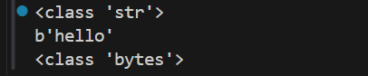

## 字符串编码

Unicode：所有字符都是两个字符

字符与数字之间的转换更快一些
占用空间大

UTF-8：精准，对不同字符用不同的长度表示

节省空间
字符与数字的转换速度较慢

### 字符串编码转换


```python
a = 'hello'

print(type(a))

a1 = a.encode()  # 解码

print(a1)

print(type(a1))

a2 = a1.decode()
print(a2,type(a2))  # hello,<class 'bytes'>

```



str ：字符串是以字符为单位进行处理
bytes ：以字节为单位进行处理


## 字符串的常见操作

 一、字符串拼接（+）


