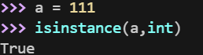
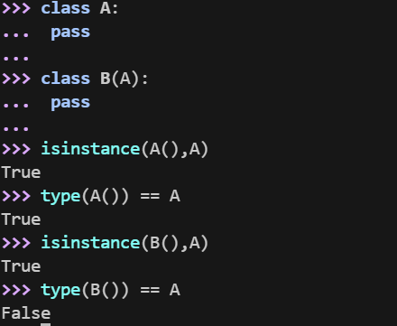

Python 中的变量不需要声明。每个变量在使用前都必须赋值，变量赋值以后该变量才会被创建。

在 Python 中，变量就是变量，它没有类型，我们所说的"类型"是变量所指的内存中对象的类型。

等号（=）用来给变量赋值。

等号（=）运算符左边是一个变量名,等号（=）运算符右边是存储在变量中的值。


## 多个变量赋值

Python允许你同时为多个变量赋值。

```python
a = b = c = 1
```

也可以为多个对象指定多个变量。

```python
a, b, c = 1, 2, "runoob"
```

可以通过 type() 函数查看变量的类型。


```python
# 变量定义

x = 10          # 整数

y = 3.14         # 浮点数

name = "Alice"   # 字符串

is_active = True # 布尔值

  

# 多变量赋值

a, b, c = 1, 2, "three"

  

# 查看数据类型

print(type(x))        # <class 'int'>

print(type(y))        # <class 'float'>

print(type(name))     # <class 'str'>

print(type(is_active)) # <class 'bool'>
```


## 标准数据类型

Python3 中常见的数据类型有：

- Number（数字）
- String（字符串）
- bool（布尔类型）
- List（列表）
- Tuple（元组）
- Set（集合）
- Dictionary（字典）

Python3 的六个标准数据类型中：

- 不可变数据（3 个）：Number（数字）、String（字符串）、Tuple（元组）；
- 可变数据（3 个）：List（列表）、Dictionary（字典）、Set（集合）。

---

### Number（数字）

Python3 支持 **int、float、bool、complex（复数）**。

在Python 3里，只有一种整数类型 int，表示为长整型，没有 python2 中的 Long。

内置的 type() 函数可以用来查询变量所指的对象类型。


注：在python中，虚数使用 j 或 J 表示。

此外还可以用 isinstance 来判断。



isinstance 和 type 的区别在于：

- type()不会认为子类是一种父类类型。
- isinstance()会认为子类是一种父类类型。

---



解析：
```python
class A: pass
class B(A): pass
```

class : 定义一个类
class A:  定义了子类A
class B(A):  定义了子类 `B`，它**继承**自 `A`。这意味着 `B` 是一种特殊的 `A`

pass : 占位符，Python 依靠**缩进**来组织代码块。如果你的代码里写了 `def`、`class`、`if` 或 `for` 等语句（后面带着冒号 `:`），Python 语法的规则主要求冒号后面**必须**有至少一行缩进的代码。

如果此时你还没想好要在里面写什么，或者根本不需要写什么，你不能空着，否则程序会报错（`IndentationError`）。这时就需要用 `pass` 来填补这个空缺，告诉 Python：“这里有个空代码块，是合法的，请继续往下执行。”

```python
>>> isinstance(A(), A)
True
>>> type(A()) == A
True
```

- `A()` 创建了一个 `A` 类的实例。
- 必然地，它既是 `A` 的实例（`isinstance` 为真），其类型也严格等于 `A`（`type` 为真）。

```python
>>> isinstance(B(), A) 
True
```

- `B()` 是子类 `B` 的一个实例。
- **`isinstance` 的逻辑是：**“这个对象是 A 类，**或者是 A 的子类**吗？”
- 因为 `B` 继承自 `A`（B 是一种 A），所以 Python 判定这是 `True`。

```python
>>> type(B()) == A
False
```

- `type(B())` 返回的是对象的准确类型，即 `class B`。
- 这里的比较变成了：`class B == class A` 吗？
- 显然，`B` 类和 `A` 类虽然有父子关系，但它们是两个**不同**的类对象。它们在内存中是不一样的，所以结果是 `False`。

---


`issubclass()` 的作用是判断**一个类（Class）是否是另一个类的子类**。

#### issubclass vs isinstance（核心区别）

- **`isinstance(obj, Class)`**:
    - 检查对象（实例）。
    - 参数：左边是**对象**（即 `A()` 或 `B()`），右边是**类**。

- **`issubclass(Class, Class)`**:
    
    - **检查类（模具）**。
    - 参数：左边是**类**（即 `B`），右边也是**类**（即 `A`）。
