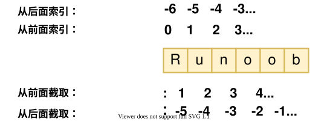
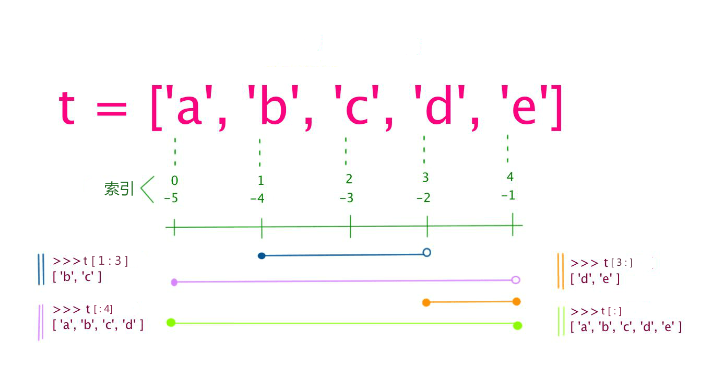
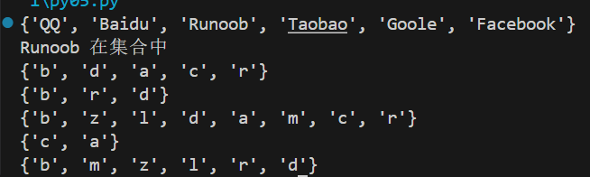

Python 中的变量不需要声明。每个变量在使用前都必须赋值，变量赋值以后该变量才会被创建。

在 Python 中，变量就是变量，它没有类型，我们所说的"类型"是变量所指的内存中对象的类型。

等号（=）用来给变量赋值。

等号（=）运算符左边是一个变量名,等号（=）运算符右边是存储在变量中的值。


## 多个变量赋值

Python允许你同时为多个变量赋值。

```python
a = b = c = 1
```

也可以为多个对象指定多个变量。

```python
a, b, c = 1, 2, "runoob"
```

可以通过 type() 函数查看变量的类型。


```python
# 变量定义

x = 10          # 整数

y = 3.14         # 浮点数

name = "Alice"   # 字符串

is_active = True # 布尔值

  

# 多变量赋值

a, b, c = 1, 2, "three"

  

# 查看数据类型

print(type(x))        # <class 'int'>

print(type(y))        # <class 'float'>

print(type(name))     # <class 'str'>

print(type(is_active)) # <class 'bool'>
```


## 标准数据类型

Python3 中常见的数据类型有：

- Number（数字）
- String（字符串）
- bool（布尔类型）
- List（列表）
- Tuple（元组）
- Set（集合）
- Dictionary（字典）

Python3 的六个标准数据类型中：

- 不可变数据（3 个）：Number（数字）、String（字符串）、Tuple（元组）；
- 可变数据（3 个）：List（列表）、Dictionary（字典）、Set（集合）。

---

### Number（数字）

Python3 支持 **int、float、bool、complex（复数）**。

在Python 3里，只有一种整数类型 int，表示为长整型，没有 python2 中的 Long。

内置的 type() 函数可以用来查询变量所指的对象类型。


注：在python中，虚数使用 j 或 J 表示。

此外还可以用 isinstance 来判断。


isinstance 和 type 的区别在于：

- type()不会认为子类是一种父类类型。
- isinstance()会认为子类是一种父类类型。

---


解析：
```python
class A: pass
class B(A): pass
```

class : 定义一个类
class A:  定义了子类A
class B(A):  定义了子类 `B`，它**继承**自 `A`。这意味着 `B` 是一种特殊的 `A`

pass : 占位符，Python 依靠**缩进**来组织代码块。如果你的代码里写了 `def`、`class`、`if` 或 `for` 等语句（后面带着冒号 `:`），Python 语法的规则主要求冒号后面**必须**有至少一行缩进的代码。

如果此时你还没想好要在里面写什么，或者根本不需要写什么，你不能空着，否则程序会报错（`IndentationError`）。这时就需要用 `pass` 来填补这个空缺，告诉 Python：“这里有个空代码块，是合法的，请继续往下执行。”

```python
>>> isinstance(A(), A)
True
>>> type(A()) == A
True
```

- `A()` 创建了一个 `A` 类的实例。
- 必然地，它既是 `A` 的实例（`isinstance` 为真），其类型也严格等于 `A`（`type` 为真）。

```python
>>> isinstance(B(), A) 
True
```

- `B()` 是子类 `B` 的一个实例。
- **`isinstance` 的逻辑是：**“这个对象是 A 类，**或者是 A 的子类**吗？”
- 因为 `B` 继承自 `A`（B 是一种 A），所以 Python 判定这是 `True`。

```python
>>> type(B()) == A
False
```

- `type(B())` 返回的是对象的准确类型，即 `class B`。
- 这里的比较变成了：`class B == class A` 吗？
- 显然，`B` 类和 `A` 类虽然有父子关系，但它们是两个**不同**的类对象。它们在内存中是不一样的，所以结果是 `False`。

---


`issubclass()` 的作用是判断**一个类（Class）是否是另一个类的子类**。

#### issubclass vs isinstance（核心区别）

- **`isinstance(obj, Class)`**:
    - 检查对象（实例）。
    - 参数：左边是**对象**（即 `A()` 或 `B()`），右边是**类**。

- **`issubclass(Class, Class)`**:
    
    - **检查类（模具）**。
    - 参数：左边是**类**（即 `B`），右边也是**类**（即 `A`）。

---

#### `del` 语句：

##### 1. 删除变量（删除引用）

这是最基本的用法。当你 `del` 一个变量时，你实际上是告诉 Python：“我不再用这个名字了，把这个名字从当前的命名空间中移除。”

```python
x = 10
print(x)  # 输出: 10

del x

# print(x)  
# 报错: NameError: name 'x' is not defined
# 因为 x 这个标签已经被撕掉了，Python 不认识它是谁了。
```

**⚠️ 注意：** 这一步并不一定会立即把 `10` 这个数据从内存里删掉。如果还有其他变量（别名）指向 `10`，数据依然存在。

```python
a = [1, 2, 3]
b = a        # b 和 a 指向同一个列表

del a        # 删除了 a 这个标签
print(b)     # b 依然存在，输出 [1, 2, 3]
```

##### 2. 删除列表（List）中的元素

这是 `del` 非常常用的功能，它可以通过 **索引（Index)** 或 **切片（Slice)** 来删除列表中的数据。

**按索引删除：**

```python
mylist = ['a', 'b', 'c', 'd']
del mylist[1]  # 删除索引为 1 的元素 ('b')

print(mylist)  # 输出: ['a', 'c', 'd']
```

**按切片（范围）删除：**

```python
numbers = [0, 1, 2, 3, 4, 5]
del numbers[2:4]  # 删除索引 2 到 3 的元素 (即 2 和 3)

print(numbers)    # 输出: [0, 1, 4, 5]
```

##### 3. 删除字典（Dictionary）中的键值对

```python
info = {'name': 'Tom', 'age': 18, 'city': 'New York'}

del info['age']  # 删除 'age' 这个键及其对应的值

print(info)      # 输出: {'name': 'Tom', 'city': 'New York'}
```

##### 4. 删除对象的属性

如果你在类（Class）的实例中想动态删除某个属性，也可以用 `del`。

```python
class Person:
    def __init__(self):
        self.name = "John"

p = Person()
print(p.name)  # John

del p.name     # 删除实例 p 的 name 属性

# print(p.name) # 报错: AttributeError: 'Person' object has no attribute 'name'
```

---

### String(字符串)

Python中的字符串用单引号 `'` 或双引号 `"` 括起来，同时使用反斜杠 ` \ ` 转义特殊字符。

字符串的截取的语法格式如下：
`变量[头下标:尾下标]`

索引值以 0 为开始值，-1 为从末尾的开始位置。



[[基础语法]] 中的string

Python 字符串不能被改变。向一个索引位置赋值，比如 word[0] = 'm' 会导致错误。

---

### bool（布尔类型）

- 布尔类型只有两个值：True 和 False。
    
- bool 是 int 的子类，因此布尔值可以被看作整数来使用，其中 True 等价于 1。
    
- 布尔类型可以和其他数据类型进行比较，比如数字、字符串等。在比较时，Python 会将 True 视为 1，False 视为 0。
    
- 布尔类型可以和逻辑运算符一起使用，包括 and、or 和 not。这些运算符可以用来组合多个布尔表达式，生成一个新的布尔值。
    
- 布尔类型也可以被转换成其他数据类型，比如整数、浮点数和字符串。在转换时，True 会被转换成 1，False 会被转换成 0。
    
- 可以使用 `bool()` 函数将其他类型的值转换为布尔值。以下值在转换为布尔值时为 `False`：`None`、`False`、零 (`0`、`0.0`、`0j`)、空序列（如 `''`、`()`、`[]`）和空映射（如 `{}`）。其他所有值转换为布尔值时均为 `True`。

---

### List(列表)

列表可以完成大多数集合类的数据结构实现。列表中元素的类型可以不相同，它支持数字，字符串甚至可以包含列表（所谓嵌套）。

列表是写在方括号 [] 之间、用逗号分隔开的元素列表。

和字符串一样，列表同样可以被索引和截取，列表被截取后返回一个包含所需元素的新列表。

列表截取的语法格式如下：
`变量[头下标:尾下标]`

索引值以 0 为开始值，-1 为从末尾的开始位置。



加号 + 是列表连接运算符，星号 * 是重复操作。如下实例：

```python
#!/usr/bin/python3

list = [ 'abcd', 786 , 2.23, 'runoob', 70.2 ]  # 定义一个列表
tinylist = [123, 'runoob']

print (list)            # 打印整个列表
print (list[0])         # 打印列表的第一个元素
print (list[1:3])       # 打印列表第二到第四个元素（不包含第四个元素）
print (list[2:])        # 打印列表从第三个元素开始到末尾
print (tinylist * 2)    # 打印tinylist列表两次
print (list + tinylist)  # 打印两个列表拼接在一起的结果
```

与Python字符串不一样的是，列表中的元素是可以改变的：

```python
>>> a = [1, 2, 3, 4, 5, 6]
>>> a[0] = 9
>>> a[2:5] = [13, 14, 15]
>>> a
[9, 2, 13, 14, 15, 6]
>>> a[2:5] = []   # 将对应的元素值设置为 [] 
>>> a
[9, 2, 6]
```

---

Python 列表截取可以接收第三个参数，参数作用是截取的步长，以下实例在索引 1 到索引 4 的位置并设置为步长为 2（间隔一个位置）来截取字符串：


如果第三个参数为负数表示逆向读取，以下实例用于翻转字符串：


```python
def reverseWords(input):

     # 通过空格将字符串分隔符，把各个单词分隔为列表

    words = input.split()

    reversed_words = words[::-1]

    return ' '.join(reversed_words)

  

input_string = "Hello World"

reversed_string = reverseWords(input_string)

print(reversed_string)  # Output: "World Hello"
```


---
### Tuple(元组)

元组（tuple）与列表类似，不同之处在于元组的元素不能修改。元组写在小括号 () 里，元素之间用逗号隔开。

- 1、与字符串一样，元组的元素不能修改。
- 2、元组也可以被索引和切片，方法一样。
- 3、注意构造包含 0 或 1 个元素的元组的特殊语法规则。
- 4、元组也可以使用 + 操作符进行拼接。


构造包含 0 个或 1 个元素的元组比较特殊，所以有一些额外的语法规则：

```python
tup1 = ()    # 空元组
tup2 = (20,) # 一个元素，需要在元素后添加逗号
```

如果你想创建只有一个元素的元组，需要注意在元素后面添加一个逗号，以区分它是一个元组而不是一个普通的值，这是因为在没有逗号的情况下，Python会将括号解释为数学运算中的括号，而不是元组的表示。

---

### Set(集合)

Python 中的集合（Set）是一种无序、可变的数据类型，用于存储唯一的元素。

集合中的元素不会重复，并且可以进行交集、并集、差集等常见的集合操作。

在 Python 中，集合使用大括号 {} 表示，元素之间用逗号 , 分隔。

另外，也可以使用 set() 函数创建集合。

**注意**：创建一个空集合必须用 set() 而不是 { }，因为 { } 是用来创建一个空字典。

格式：

```python
parame = {value01,value02,...}
或者
set(value)
```


```python
sites = {'Goole', 'Runoob', 'Taobao', 'Baidu', 'QQ', 'Facebook'}

print(sites)

if 'Runoob' in sites:

    print('Runoob 在集合中')

else:    print('Runoob 不在集合中')

  

a = set('abracadabra')

b = set('alacazam')

  

print(a)  # 输出：{'a', 'b', 'c', 'd', 'r'}

print(a - b)  # 输出：{'r', 'd', 'b'} 差集

print(a | b)  # 输出：{'a', 'b', 'c', 'd', 'r', 'l', 'z', 'm'} 并集

print(a & b)  # 输出：{'a', 'c'} 交集

print(a ^ b)  # 输出：{'b', 'd', 'r', 'l', 'z', 'm'} 不同时存在于a和b中的元素集合（对称差集）
```



打印乱序：

**集合（Set）** 的设计初衷不是为了存序列，而是为了**去重**和**数学运算**（交集、并集）。

- **原理：** 集合存储元素时，是根据元素的“哈希值（Hash Value）”来决定放在哪里的，而不是根据你先来后到的顺序。
- **现象：** 对于简单的整数（如 1, 2, 3），哈希值通常就是它们本身，所以打印出来经常是排序好的（1, 2, 3）。但如果是复杂的字符串或数字，顺序看起来就会非常随机。

---

### Dictionary(字典)

