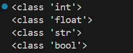
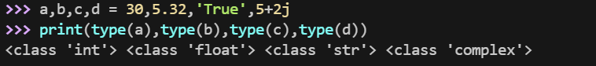

Python 中的变量不需要声明。每个变量在使用前都必须赋值，变量赋值以后该变量才会被创建。

在 Python 中，变量就是变量，它没有类型，我们所说的"类型"是变量所指的内存中对象的类型。

等号（=）用来给变量赋值。

等号（=）运算符左边是一个变量名,等号（=）运算符右边是存储在变量中的值。


## 多个变量赋值

Python允许你同时为多个变量赋值。

```python
a = b = c = 1
```

也可以为多个对象指定多个变量。

```python
a, b, c = 1, 2, "runoob"
```

可以通过 type() 函数查看变量的类型。


```python
# 变量定义

x = 10          # 整数

y = 3.14         # 浮点数

name = "Alice"   # 字符串

is_active = True # 布尔值

  

# 多变量赋值

a, b, c = 1, 2, "three"

  

# 查看数据类型

print(type(x))        # <class 'int'>

print(type(y))        # <class 'float'>

print(type(name))     # <class 'str'>

print(type(is_active)) # <class 'bool'>
```




## 标准数据类型

Python3 中常见的数据类型有：

- Number（数字）
- String（字符串）
- bool（布尔类型）
- List（列表）
- Tuple（元组）
- Set（集合）
- Dictionary（字典）

Python3 的六个标准数据类型中：

- 不可变数据（3 个）：Number（数字）、String（字符串）、Tuple（元组）；
- 可变数据（3 个）：List（列表）、Dictionary（字典）、Set（集合）。

### Number（数字）

Python3 支持 **int、float、bool、complex（复数）**。

在Python 3里，只有一种整数类型 int，表示为长整型，没有 python2 中的 Long。

内置的 type() 函数可以用来查询变量所指的对象类型。



注：在python中，虚数使用 j 或 J 表示。

此外还可以用 isinstance 来判断。

