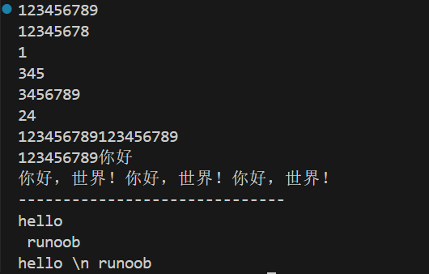
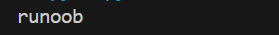
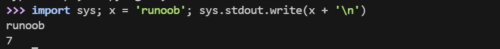

## 注释

单行：#

多行：多个 `#` , `'''` , `"""`


## 多行语句

Python 通常是一行写完一条语句，但如果语句很长，我们可以使用反斜杠 \ 来实现多行语句，例如：


``` python
total = item_one + \
        item_two + \
        item_three

```

在 [], {}, 或 () 中的多行语句，不需要使用反斜杠 \，例如：

``` python
total = ['item_one', 'item_two', 'item_three',
        'item_four', 'item_five']

```


## 数字

ython中数字有四种类型：整数、布尔型、浮点数和复数。

- **int** (整数), 如 1, 只有一种整数类型 int，表示为长整型，没有 python2 中的 Long。
- **bool** (布尔), 如 True、False
- **float** (浮点数), 如 1.23、3E-2
- **complex** (复数) - 复数由实部和虚部组成，形式为 a + bj，其中 a 是实部，b 是虚部，j 表示虚数单位。如 1 + 2j、 1.1 + 2.2j

## 字符串

- Python 中单引号 ' 和双引号 " 使用完全相同。
- 使用三引号(''' 或 """)可以指定一个多行字符串。
- 转义符 \。
- 反斜杠可以用来转义，使用 r 可以让反斜杠不发生转义。 如 **r"this is a line with \n"** 则 \n 会显示，并不是换行。
- 按字面意义级联字符串，如 **"this " "is " "string"** 会被自动转换为 **this is string**。
- 字符串可以用 + 运算符连接在一起，用 * 运算符重复。
- ==Python 中的字符串有两种索引方式，从左往右以 0 开始，从右往左以 -1 开始。==
- Python 中的字符串不能改变。
- Python 没有单独的字符类型，一个字符就是长度为 1 的字符串。
- ==字符串切片 `str[start:end]`，其中 start（包含）是切片开始的索引，end（不包含）是切片结束的索引。==
- 字符串的切片可以加上步长参数 step，语法格式如下：`str[start:end:step]`


```python
str='123456789'

print(str)                 # 输出字符串

print(str[0:-1])           # 输出第一个到倒数第二个的所有字符

print(str[0])              # 输出字符串第一个字符

print(str[2:5])            # 输出从第三个开始到第六个的字符（不包含）

print(str[2:])             # 输出从第三个开始后的所有字符

print(str[1:5:2])          # 输出从第二个开始到第五个且每隔一个的字符（步长为2）

print(str * 2)             # 输出字符串两次

print(str + '你好')         # 连接字符串

print('你好，世界！' * 3)   # 输出字符串三次        

print('------------------------------')

print('hello\n runoob')      # 使用反斜杠(\)+n转义特殊字符

print(r'hello \n runoob')     # 在字符串前面添加一个 r，表示原始字符串，不会发生转义
```



## 同一行显示多条语句

Python 可以在同一行中使用多条语句，语句之间使用分号 ; 分割，以下是一个简单的实例：

```python
import sys; x = 'runoob'; sys.stdout.write(x + '\n')
```



使用交互式命令行执行



此处的 7 表示字符数，runoob有6个字符，\n 表示一个字符，加起来7个字符


## 代码组

[[1.5 控制]] 中有关字句（clause) 