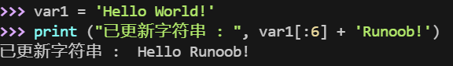

## Python 字符串更新

你可以截取字符串的一部分并与其他字段拼接




## Python 转义字符

在需要在字符中使用特殊字符时，python 用反斜杠 \ 转义字符。如下表：

| 转义字符    | 描述                                                    | 实例                                                                                                        |
| ------- | ----------------------------------------------------- | --------------------------------------------------------------------------------------------------------- |
| \(在行尾时) | 续行符                                                   | ```<br>>>> print("line1 \<br>... line2 \<br>... line3")<br>line1 line2 line3<br>>>>                       |
| \\      | 反斜杠符号                                                 | ```<br>>>> print("\\")<br>\                                                                               |
| \'      | 单引号                                                   | ```<br>>>> print('\'')<br>'                                                                               |
| \"      | 双引号                                                   | >>> print("\"")<br>"                                                                                      |
| \a      | 响铃                                                    | >>> print("\a")<br><br>执行后电脑有响声。                                                                          |
| \b      | 退格(Backspace)                                         | >>> print("Hello \b World!")<br>Hello World!                                                              |
| \000    | 空                                                     | >>> print("\000")<br><br>>>>                                                                              |
| \n      | 换行                                                    | >>> print("\n")<br><br>>>>                                                                                |
| \v      | 纵向制表符                                                 | >>> print("Hello \v World!")<br>Hello <br>       World!<br>>>>                                            |
| \t      | 横向制表符                                                 | >>> print("Hello \t World!")<br>Hello      World!<br>>>>                                                  |
| \r      | 回车，将 \r 后面的内容移到字符串开头，并逐一替换开头部分的字符，直至将 \r 后面的内容完全替换完成。 | >>> print("Hello\rWorld!")<br>World!<br>>>> print('google runoob taobao\r123456')<br>123456 runoob taobao |
| \f      | 换页                                                    | >>> print("Hello \f World!")<br>Hello <br>       World!<br>>>>                                            |
| \yyy    | 八进制数，y 代表 0~7 的字符，例如：\012 代表换行。                       | >>> print("\110\145\154\154\157\40\127\157\162\154\144\41")<br>Hello World!                               |
| \xyy    | 十六进制数，以 \x 开头，y 代表的字符，例如：\x0a 代表换行                    | >>> print("\x48\x65\x6c\x6c\x6f\x20\x57\x6f\x72\x6c\x64\x21")<br>Hello World!                             |
| \other  | 其它的字符以普通格式输出                                          |                                                                                                           |

## Python 字符串运算符

下表实例变量 a 值为字符串 "Hello"，b 变量值为 "Python"：

| 操作符    | 描述                                                                                                     | 实例                               |
| ------ | ------------------------------------------------------------------------------------------------------ | -------------------------------- |
| +      | 字符串连接                                                                                                  | a + b 输出结果： HelloPython          |
| *      | 重复输出字符串                                                                                                | a*2 输出结果：HelloHello              |
| []     | 通过索引获取字符串中字符                                                                                           | a[1] 输出结果 **e**                  |
| [ : ]  | 截取字符串中的一部分，遵循**左闭右开**原则，str[0:2] 是不包含第 3 个字符的。                                                         | a[1:4] 输出结果 **ell**              |
| in     | 成员运算符 - 如果字符串中包含给定的字符返回 True                                                                           | **'H' in a** 输出结果 True           |
| not in | 成员运算符 - 如果字符串中不包含给定的字符返回 True                                                                          | **'M' not in a** 输出结果 True       |
| r/R    | 原始字符串 - 原始字符串：所有的字符串都是直接按照字面的意思来使用，没有转义特殊或不能打印的字符。 原始字符串除在字符串的第一个引号前加上字母 r（可以大小写）以外，与普通字符串有着几乎完全相同的语法。 | print( r'\n' )<br>print( R'\n' ) |
| %      | 格式字符串                                                                                                  | 请看下一节内容。                         |