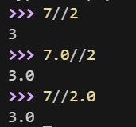
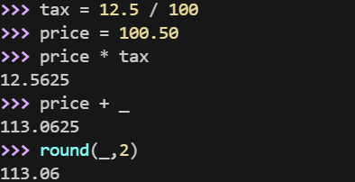

## 数字类型转换

- **int(x)** 将x转换为一个整数。
    
- **float(x)** 将x转换到一个浮点数。
    
- **complex(x)** 将x转换到一个复数，实数部分为 x，虚数部分为 0。
    
- **complex(x, y)** 将 x 和 y 转换到一个复数，实数部分为 x，虚数部分为 y。x 和 y 是数字表达式。

## 数字运算

// 得到的并不一定是整数类型的数，它与分母分子的数据类型有关系。

在交互模式中，最后被输出的表达式结果被赋值给变量 _ 。例如：

## 数学函数

|函数|返回值 ( 描述 )|
|---|---|
|[abs(x)](https://www.runoob.com/python3/python3-func-number-abs.html)|返回数字的绝对值，如abs(-10) 返回 10|
|[ceil(x)](https://www.runoob.com/python3/python3-func-number-ceil.html)|返回数字的上入整数，如math.ceil(4.1) 返回 5|
|cmp(x, y)|如果 x < y 返回 -1, 如果 x == y 返回 0, 如果 x > y 返回 1。 **Python 3 已废弃，使用 (x>y)-(x<y) 替换**。|
|[exp(x)](https://www.runoob.com/python3/python3-func-number-exp.html)|返回e的x次幂(ex),如math.exp(1) 返回2.718281828459045|
|[fabs(x)](https://www.runoob.com/python3/python3-func-number-fabs.html)|以浮点数形式返回数字的绝对值，如math.fabs(-10) 返回10.0|
|[floor(x)](https://www.runoob.com/python3/python3-func-number-floor.html)|返回数字的下舍整数，如math.floor(4.9)返回 4|
|[log(x)](https://www.runoob.com/python3/python3-func-number-log.html)|如math.log(math.e)返回1.0,math.log(100,10)返回2.0|
|[log10(x)](https://www.runoob.com/python3/python3-func-number-log10.html)|返回以10为基数的x的对数，如math.log10(100)返回 2.0|
|[max(x1, x2,...)](https://www.runoob.com/python3/python3-func-number-max.html)|返回给定参数的最大值，参数可以为序列。|
|[min(x1, x2,...)](https://www.runoob.com/python3/python3-func-number-min.html)|返回给定参数的最小值，参数可以为序列。|
|[modf(x)](https://www.runoob.com/python3/python3-func-number-modf.html)|返回x的整数部分与小数部分，两部分的数值符号与x相同，整数部分以浮点型表示。|
|[pow(x, y)](https://www.runoob.com/python3/python3-func-number-pow.html)|x**y 运算后的值。|
|[round(x [,n])](https://www.runoob.com/python3/python3-func-number-round.html)|返回浮点数 x 的四舍五入值，如给出 n 值，则代表舍入到小数点后的位数。  **其实准确的说是保留值将保留到离上一位更近的一端。**|
|[sqrt(x)](https://www.runoob.com/python3/python3-func-number-sqrt.html)|返回数字x的平方根。|