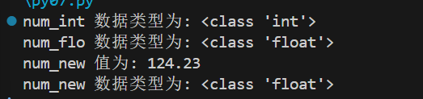

## 隐式类型转换

在隐式类型转换中，Python 会自动将一种数据类型转换为另一种数据类型，不需要我们去干预。


```python
num_int = 123
num_flo = 1.23

num_new = num_int + num_flo

print("num_int 数据类型为:",type(num_int))
print("num_flo 数据类型为:",type(num_flo))

print("num_new 值为:",num_new)
print("num_new 数据类型为:",type(num_new))
```



Python 会将较小的数据类型转换为较大的数据类型，以避免数据丢失。


## 显式类型转换

在显式类型转换中，用户将对象的数据类型转换为所需的数据类型。 我们使用 int()（强制转换为整型）、float()（强制转换为浮点型）、str() （强制转换为字符串类型）等预定义函数来执行显式类型转换。


