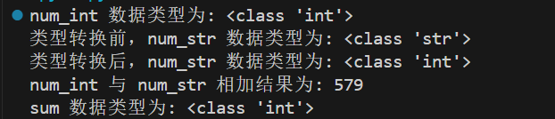

## 隐式类型转换

在隐式类型转换中，Python 会自动将一种数据类型转换为另一种数据类型，不需要我们去干预。


```python
num_int = 123
num_flo = 1.23

num_new = num_int + num_flo

print("num_int 数据类型为:",type(num_int))
print("num_flo 数据类型为:",type(num_flo))

print("num_new 值为:",num_new)
print("num_new 数据类型为:",type(num_new))
```


Python 会将较小的数据类型转换为较大的数据类型，以避免数据丢失。


## 显式类型转换

在显式类型转换中，用户将对象的数据类型转换为所需的数据类型。 我们使用 int()（强制转换为整型）、float()（强制转换为浮点型）、str() （强制转换为字符串类型）等预定义函数来执行显式类型转换。


```python
num_int = 123
num_str = "456"

print("num_int 数据类型为:",type(num_int))
print("类型转换前，num_str 数据类型为:",type(num_str))

num_str = int(num_str)    # 强制转换为整型
print("类型转换后，num_str 数据类型为:",type(num_str))

num_sum = num_int + num_str

print("num_int 与 num_str 相加结果为:",num_sum)
print("sum 数据类型为:",type(num_sum))
```




|函数|描述|
|---|---|
|[int(x [,base])](https://www.runoob.com/python3/python-func-int.html)|将x转换为一个整数|
|[float(x)](https://www.runoob.com/python3/python-func-float.html)|将x转换到一个浮点数|
|[complex(real [,imag])](https://www.runoob.com/python3/python-func-complex.html)|创建一个复数|
|[str(x)](https://www.runoob.com/python3/python-func-str.html)|将对象 x 转换为字符串|
|[repr(x)](https://www.runoob.com/python3/python-func-repr.html)|将对象 x 转换为表达式字符串|
|[eval(str)](https://www.runoob.com/python3/python-func-eval.html)|用来计算在字符串中的有效Python表达式,并返回一个对象|
|[tuple(s)](https://www.runoob.com/python3/python3-func-tuple.html)|将序列 s 转换为一个元组|
|[list(s)](https://www.runoob.com/python3/python3-att-list-list.html)|将序列 s 转换为一个列表|
|[set(s)](https://www.runoob.com/python3/python-func-set.html)|转换为可变集合|
|[dict(d)](https://www.runoob.com/python3/python-func-dict.html)|创建一个字典。d 必须是一个 (key, value)元组序列。|
|[frozenset(s)](https://www.runoob.com/python3/python-func-frozenset.html)|转换为不可变集合|
|[chr(x)](https://www.runoob.com/python3/python-func-chr.html)|将一个整数转换为一个字符|
|[ord(x)](https://www.runoob.com/python3/python-func-ord.html)|将一个字符转换为它的整数值|
|[hex(x)](https://www.runoob.com/python3/python-func-hex.html)|将一个整数转换为一个十六进制字符串|
|[oct(x)](https://www.runoob.com/python3/python-func-oct.html)|将一个整数转换为一个八进制字符串|
